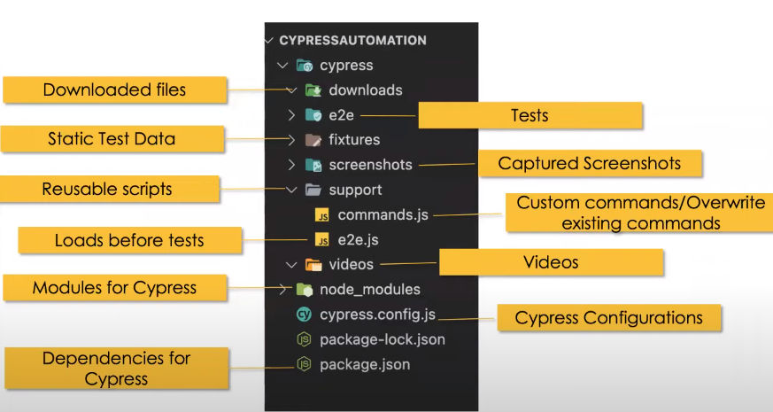

# Cypress E2E Testing (Web and API)

## Topics

Periksa folder `cypress/e2e/` dan arahkan ke file spesifikasi yang diinginkan untuk melihat implementasinya. Setiap file spesifikasi berisi tautan ke dokumentasi resmi serta sumber daya lain yang bermanfaat untuk penjelasan rinci.

### UI

- Basics
- Locator strategies
- Assertions
- Actions
- Alerts
- New Tab or Windows
- iFrame
- Web Tables
- Mouse Actions
- File upload and download
- Hooks and Tags
- Fixtures
- Data Driven Testing
- Custom Commands
- Navigation
- Screenshots and Videos recording
- Test Reporting
- Page Object Model (POM)
- Reading data from CSV files
-

### API

- HTTP Requests
- Request Body
- Query Parameters
- Headers and Cookies
- Parsing response
- Schema validation
- XML Resonse Handling
- Authentication
- OAuth 2.0
- API Chaining
- Cypress API Plugin
- Intercepting APIs(Mock and Stub)
-

## Starting Instructions

- Setup project
  `npm init i`
- Install Cypress
  `npm intstall cypress --save -dev`
- Open Cypress test runner
  `npx cypress open`
- Run cypress tests from terminal
  `npx cypress run`
- Run cypress tests from terminal in headed mode
  `npx cypress run --headed`
- Run specific test spec
  `npx cypress run --spec cypress\e2e\mytest.cy.js`
- Run test on specified browser
  `npx cypress run --browser chrome`
- Run test on specified browser in headed mode
  `npx cypress run --browser chrome --headed`

## Notes

> Buka cmd dari folder mana pun di jendela dengan memasukkan cmd di bilah alamat penjelajah windows dari folder tertentu

- Pengaturan Kode VS
  Untuk membuka editor Pengaturan, buka File > Preferensi > Pengaturan.

Anda juga dapat membuka editor Pengaturan dari Palet Perintah (Ctrl + Shift + P) dengan Preferensi: Buka Pengaturan atau gunakan pintasan keyboard (Ctrl+,).

- Komentar Kode VS:
  - Shift + Alt + Komentar beberapa baris
  - Ctrl + / komentar satu baris

> Tambahkan di bagian atas untuk mengaktifkan intellisense. `/// <reference types="Cypress" />` atau Anda bisa meletakkannya di support/commands.js

- Jika Anda menulis perintah khusus dan memberikan definisi TypeScript untuk perintah tersebut, Anda dapat menggunakan arahan garis miring tiga untuk menampilkan IntelliSense, meskipun proyek Anda hanya menggunakan JavaScript. Sebagai contoh, jika perintah kustom Anda ditulis di cypress/support/commands.js dan Anda mendeskripsikannya di cypress/support/index.d.ts gunakan:

  ```
  // mengetikkan definisi untuk perintah kustom seperti "createDefaultTodos"
  <reference types="../support" />
  ```

- Kasus uji cypress memiliki akhiran `.cy.js`

- Cypress hanya mendukung peramban berbasis kromium.
- Cypress mendukung CSSSelectors dan XPath dengan plugin (XPath sekarang sudah tidak digunakan lagi).
- Tag bersifat opsional di CSS Selectors.
- Cypress test runner secara otomatis mengeksekusi kasus uji pada perubahan baru yang disimpan.

## Cuplikan Cypress Plugin

https://marketplace.visualstudio.com/items?itemName=CliffSu.cypress-snippets

- Anda juga dapat menemukan elemen di cypress test runer dengan mengklik elemen dan kemudian menyalin cypress locator.

- Struktur Folder Cypress



> Kemampuan inklusif ini tersedia di Mocha dengan menambahkan .skip() ke suite atau ke kasus uji tertentu.
> Pengujian yang dilewati akan ditandai sebagai "tertunda" pada hasil pengujian.
> Pilihan cepat lainnya adalah menambahkan x ke it atau describe:
> https://danielkorn.io/post/skipping-tests-in-mochajs/

> Atau hanya bisa mengeksekusi tes tertentu dengan it.only()
